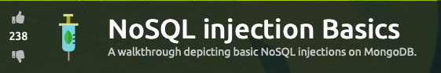
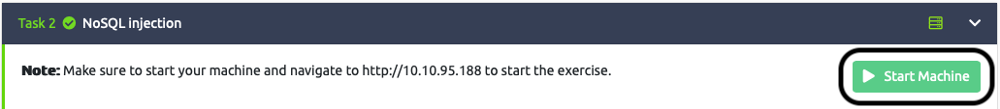
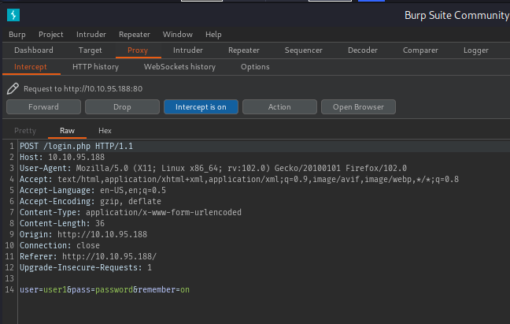
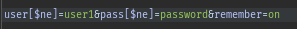
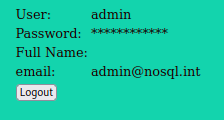
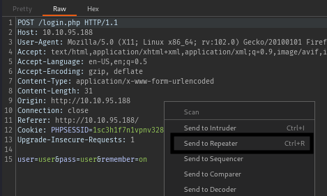
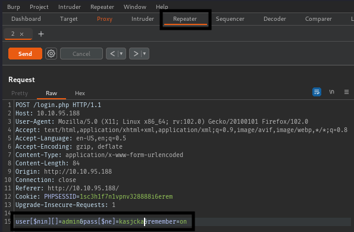
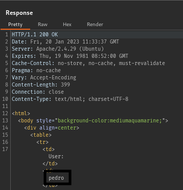
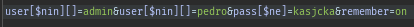

<h1>TryHackMe - NoSQL injection Basics</h1>

<ul>
    <li>
        <h3>Task 1:</h3>
        <ol type="1">
            <li>
                <strong>A group of documents in MongoDB is known as a...</strong> 
                <code>collection</code>
            </li>
            <li>
                <strong>Using the MongoDB Operator Reference, find an operator to filter data when a field isn't equal to a given value</strong> 
                <code>$ne</code>
            </li>
            <li>
                <strong>A group of documents in MongoDB is known as a...</strong> 
                <code>0</code>
            </li>
        </ol>
    </li>
    <li>
        <h3>Task 3:</h3>
        <ol type="1">
            <li>
                <strong>When bypassing the login screen using the $ne operator, which user are you logged in as?</strong>
                <ul>
                    <li>
                        Start Machine 
                        
                    </li>
                    <li>Open the ip on browser</li>
                    <li>
                        Turn on burpsuite to intercept the login request.
                    </li>
                    <li>Enter random values inside input field and subimt.</li>
                    <li>
                        Switch to burpsuite where the request is intercepted  
                        
                    </li>
                    <li>
                        Add <code>[$ne]</code> after <code>user</code> and <code>pass</code> 
                        
                    </li>
                    <li>
                        Forward the requests and you will have the answer for the task.  
                          
                        Don't use <code>admin</code> for username or you will get a different username after the injection.
                    </li>
                </ul>
            </li>
        </ol>
    </li>
    <li>
        <h3>Task 4:</h3>
        <strong>I will intercept the login request and send it to repeater so that i dont have to switch between firefox and burp all the time. Doing it with repeater will be easier</strong>
        <ol type="1">
            <li>
                <strong>How many users are there in total?</strong>
                <ul>
                    <li>
                        Right click on the intercepted request and click on <code>send to repeater.</code>  
                        
                    </li>
                    <li>
                        Go to repeater tab.
                    </li>
                    <li>
                        Add <code>[$nin][]</code> after <code>user</code> and <code>[$ne]</code> after <code>pass</code>  
                        
                    </li>
                    <li>
                        Click on send and then you will see a button <code>Follow Redirection</code>. Click it.  
                        You will see a new user name in the response tab now.  
                          
                        This makes 2 users.
                    </li>
                    <li>
                        Click on <code>&lt;</code> on the right of <code>cancel</code> button.
                    </li>
                    <li>
                        Append <code>&user[$nin][]=pedro</code> to find the third user.  
                          
                        And we have our 3rd user.
                    </li>
                    <li>
                        Append this user on top of these two and we will find that we are getting redirected to the login page which means there are <code>3</code> users.
                    </li>
                </ul>
            </li>
            <li>
                <strong>There is a user that starts with the letter "p". What is his username?</strong>  
                <code>pedro</code>
            </li>
        </ol>
    </li>
    <li>
        <h3>Task 4:</h3>
        <strong>You can read the task description and understand how we are going to brute force the password length first and then the password itself. Doing that manually can be a pain in the A**.</strong>
        To save my time i wrote a pytohn script which will do the hard word for us. It's in my repository. I have added comments to explain how it works in there.  
        <a href="https://github.com/vikashkr99/pythonScripts/blob/main/nosqlPasswordBrute.py">PythonScript</a>
        copy the code from here.
        <ol type="1">
            <li>What is john's password?</li>
            <li>One of the users seems to be reusing his password for many services. Find which one and connect through SSH to retrieve the final flag!</li>
        </ol>
    </li>
</ul>